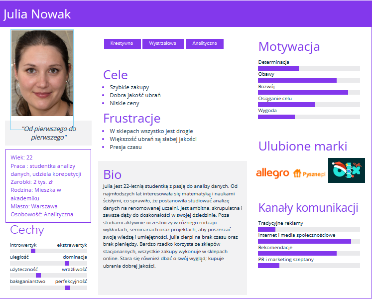

## **“Barely Owned”**

 **Aplikacja mobilna do kupna i sprzedaży używanych ubrań**

1. **Opis działania aplikacji**

Aplikacja działa jako platforma do wymiany, kupna i sprzedaży używanej odzieży i obuwia. Osoba sprzedająca wystawia przez swoje konto sprzedawane dobra, ustala ich cenę i kategorie, do których należą. Może, także dodać opis.

Kupujący przegląda ubrania, używając do tego filtrów, zapisuje w swoim katalogu , te które mu się podobają i kupuję je od sprzedającego. Może, także do niego napisać z zapytaniem o produkt, lub z propozycją obniżenia ceny.

2. **Funkcje aplikacji**
  - Profil użytkownika:
    - Rejestracja
    - Logowanie
    - Historia zamówień
    - Dodawanie produktów do katalogu obserwowanych ofert
    - Opcja resetowania hasła
  - Przeglądanie produktów:
    - Kategorie
    - Wyszukiwanie frazy
    - Filtry w wyszukiwarce (np. rozmiary, kolory)
  - Koszyk zakupowy:
    - Dodawanie produktów
    - Modyfikowanie
    - Usuwanie produktów
  - Zamawanie:
    - Dostawa
    - Wybór sposobu dostawy
    - Płatność
    - Opcje płatności
  - Opinie na temat użytkowników i produktach
  - Reklamacja/Obsługa klienta/FAQ
  - Powiadomienia
  - Zasady działania aplikacji
  - Regulamin szczegółowy

3. **PERSONA**

4. **HISTORYJKI** 

### Podstawowa historyjka użytkownika BarelyOwned
1.  Użytkownik otwiera aplikację BarelyOwned
2.  Użytkownik widzi najnowsze i najbardziej dopasowane do siebie ubrania.
3. Użytkownik może wybrać interesujący go produkt za pomocą kliknięcia w ekran lub przewijać dalej by znaleźć inne produkty

### Historyjka logowania użytkownika
  1. Użytkownik otwiera aplikację BarelyOwned
  2. Za pomocą dotyku użytkownik może przejść do okna logowania znajdującego się na dolnym pasku
  3. Użytkownik może się zalogować lub zarejestrować
  4. Po zalogowaniu lub rejestracji użytkownik jest do okna strony głównej
  5. Użytkownik może wejść na stronę edycji danych profilu

### Historyjka personalizowania produktów przez użytkownika
  1. Użytkownika otwiera aplikację BarelyOwned
  2. Użytkownik za pomocą kliknięcia przycisku znajdującego się na dolnym pasku personalizuj zostanie przekierowany do okna ustawień
  3. Użytkownik może wybrać interesujące go kategorie, rozmiary, marki oraz użytkowników.
  4. Użytkownik potwierdza swoje wybory i może wrócić do okna głównego aplikacji z widocznymi już spersonalizowanymi produktami. 

### Historyjka wyszukiwania produktu przez użytkownika
  1. Użytkownik otwiera aplikację BarelyOwned
  2. Użytkownik decyduje się kliknąć na pole wyszukiwania znajdujące się w górnej części ekranu.
  3. Zostaje przeniesiony do okna wyszukiwarki, gdzie wpisuje poszukiwany produkt odzieżowy i zatwierdza go naciskając
  4. Użytkownik może użyć narzędzi filtracji w celu zawężenia wyszukiwań, może wybrać ubrania dla odpowiedniej płci, koloru, rozmiaru itd. Może też wybrać menu pomagające mu w przeglądaniu strony i zmieniające jej wygląd zależnie od potrzeb użytkownika. Może też za pomocą dotyku przesuwać i tym sposobem przeglądać listę produktów. 
  5. Użytkownik po przytrzymaniu dotyku na produkcie przez dłuższą chwilę może zobaczyć wizualizację tego ubrania na sobie. 
  6. Użytkownik wybiera produkt interesujący go za pomocą dotyku.

### Historyjka kupowania produktu przez użytkownika
  1. Użytkownik wybiera interesujący go produkt i następnie klika dodaj za pomocą dotyku.
  2. Użytkownik może przejść do koszyka zakupowego 
  3. Użytkownik może zmodyfikować zamawiane produkty. 
  4. Użytkownik zamawia produkty, może wybrać jedną z opcji logowanie/rejestracja/kup bez rejestracji. 
  5. Użytkownik wypełnia formularz zakupowy: podaje swoje dane, adres dostawy, sposób dostawy.
  6. Może wybrać sposób płatności.
  7. Użytkownik po zatwierdzeniu zostaje przekierowany do strony płatności.
  8. Użytkownik zostaje poinformowany o zrealizowanym zamówieniu, dostaje odpowiednie potwierdzania na wprowadzonego maila.

### Historyjka zapisywania się do newslettera
  1. Użytkownik otwiera aplikację BarelyOwned 
  2. Po przewinięciu za pomocą dotyku strony na sam dół, użytkownik może wybrać zapisać się do newslettera
  3. Użytkownik  jest przenoszony do okna z newsletterem i może podać swój adres email i interesujące go produkty, o których chcę dostawać powiadomienia.
  4. Użytkownik po zatwierdzeniu dostaje potwierdzenia na email o zapisaniu się do newslettera. 

### Historyjka czytania regulaminu strony
  1. Użytkownik otwiera aplikację BarelyOwned 
  2. Po przewinięciu za pomocą dotyku strony na sam dół, użytkownik może wybrać by przeczytać regulamin
  3. Użytkownik jest przenoszony do okna z regulaminem

### Historyjka dodawania opinii o użytkowniku/produkcie
  1. Użytkownik otwiera aplikację BarelyOwned 
  2. Użytkownik wybiera na dolnym pasku swój profil przez dotyk, a następnie jest przekierowany do okna swojego profilu
  3. Użytkownik wybiera swoje ostatnie zakupy
  4. Użytkownik po potwierdzeniu przybycia paczki z ubraniem, może wystawić opinię o użytkowniku i jego produktach.

### Historyjka dodania produktu do sprzedaży.
  1. Użytkownik otwiera aplikację BarelyOwned
  2. Użytkownik wybiera na dolnym pasku opcję sprzedaj przez dotyk, i zostaje przekierowany do okna sprzedaży
  3. Użytkownik dodaje zdjęcie produktu, tytuł, opis, kategorię, markę, stan, cenę.
  4. Użytkownik zatwierdza dodanie produktu przez przycisk dodaj kilkając w niego.
  5. Użytkownik widzi jak będzie wyglądać jego ogłoszenie w miniaturze oraz z wszystkimi informacjami
  6. Użytkownik potwierdza, że zgadza się na takie ogłoszenie poprzez kliknięcie przycisku zatwierdź ogłoszenie. 

### Historyjka czatowania z innymi użytkownikami
  1. Użytkownik przeglądając informację o danym produkcie może kliknąć w ikonkę z czatem
  2. Po kliknięciu w ten przycisk zostaje przeniesiony do okna czatu i może dopytać się osoby sprzedającej o więcej szczegółów produktu
  3. Użytkownik może wybrać opcję powiadomienia, kiedy użytkownik odpowie

